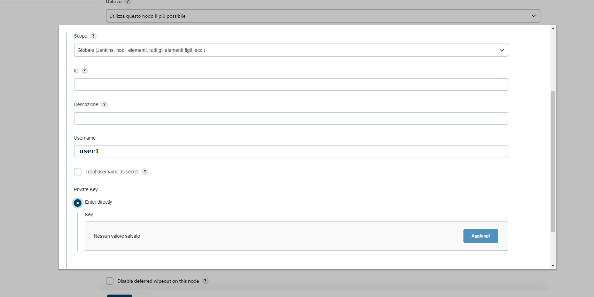

# Add a Node in Jenkins

In order to add a Node as agent go to > "Gestisci Jenkins" > "Gestisci Nodi e Cloud" in order to see the following interface:

The table show the status of Master and agent nodes (agent node "agent2" is not in line)

The "+ New Elements" allows to add a new node

When you create a node you need to check:

* The java version running in the node has to be at least openjdk version "11.0.12" 2021-07-20
* You need to create a folder in the node where the agent will be installed
* You need to decide the name of the node: "agent1", "agent2" are arbitrary names
* You need to decide the type of authentication

Once create a node pressing on the Name of the node like "agent1" you could see information on the status of the node, statistic or logs as below:

In the image above Warning signal that the connection is not secure in case of Man in the middle strategy

To avoid this Warning you need to select a "Host Key Verification Strategy", the most easy in case of user/password identification procedure is select "host known file verification strategy".

You need to go in the host that handle your agent and create in the folder selected to start the agent the .ssh folder using:

    mkdir -p .ssh

then you need to create the known_hosts file using command:

    ssh-keyscan -H "host name" >> .ssh/known_hosts

additional information at the link [using-angent](https://www.jenkins.io/doc/book/using/using-agents/)

In case the host for the agent is an ubuntu 16.04 the following command has to be used to install openJDK-11

    sudo add-apt-repository ppa:openjdk-r/ppa

    sudo apt update

    sudo apt install openjdk-11-jdk

## ssh-key generation 

A good way to add an agent is to use the ssh-key using command:

    ssh-keygen

will be generated a *.pub file and a rsa key

the .pub file has to be added to the user (example user1 in this case) home folder **/home/user1/.ssh/authorized_keys** using:

    touch .ssh/authorized_keys
    
    chmod 600 .ssh/authorized_keys

    cat *.pub >> .ssh/authorized_keys

command chwn can be used to set the same

    sudo chown user1:user1 authorized_keys

the rsa key is similar to below:

~-~-~-~--BEGIN RSA PRIVATE KEY~-~-~-~--
MIIEogIBAAKCAQEAqX6AjfHx0grg079NXAwMDN/+p/9KRQrsymyENXMNKc5Rst9c
ZHl4r67U5v5x+S/mQXG1H3zIif/jUZGo7WoFZrBDFD4rEaMKPL2MVja4DelMbKrz
....
nlA9AoGAPjsbLLDkeWPPsTMc5sie0e5uoZa9TjcdgfxwnKSHO0FBkGkM+kFTvmxW
1hXFBvdG/5MPNM2Pzhr9Q3mIdeptSBu6+BjKiS4eIA4D9t82Sg+Me24dn99kG6eY
hhY67872W5v6uqZNXU2UrsPnh0PjHJyFW5c2sGy9XStbO6QDkZ4=
~-~-~-~--END RSA PRIVATE KEY~-~-~-~--
 

The rsa key has to be copied as above in the jenkins box "Aggiungi" show in figure below

In order to remove the warning: **[SSH] WARNING: SSH Host Keys are not being verified. Man-in-the-middle attacks may be possible against this connection.** It is need add a "key verification strategy" in the node configuration section

In order to find the correct key in the machine where run jenkins:

* step1: use ssh to enter in the machine where the jenkins agent will run 

* step2: use exit to back on the machine where the jenkins agent will run

* step3 use the command below to show the key:

    ssh-keygen -F <IP_ADDRESS of the jenkins agent manchine>

you will obtain the .pub key of the machine, something like:

|1|kB2RCNxc3AGbEevUZEsdaw7Uqspo=|Wte2YWbKlje+b+vdCLB6+/eHDp4= **ecdsa-sha2-nistp256 AAAAE2VjZHNhLXNoYTItbmlzdHAyNTYAAAAIbmlzdHAyNTYAAABBBEQ3I8N2uwkXXyt8FHhfo3JD5NNtq2kdleteweT+Wey0MhabVtBqZy1q5DWTRfvWaZwNP5VkUnkDpaVk939QTDXuQ=**

only the bold part (after encryption algorithm) needs to be copied

* step4) Selecting the **"Manually provided key Verification Strategy"** and copy the string above in bold in the section showed in the figure:

In the next section a description of how [integrate with gitlab](integration_with_gitlab.md)